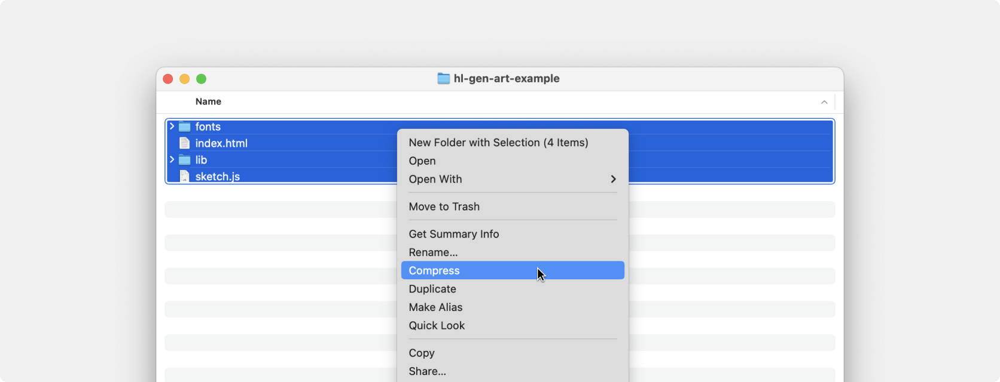

# Frequently asked questions

In this document we gathered the most common questions and issues artists have encountered. We hope this will provide you with guidelines and solutions for the problems you might encounter on your gen art journey. It will continue to evolve as time goes on so if you encounter any new problems down the line, be sure to check me again!

Before we begin, you should read the intro document linked here [README](./README.md), as it covers some of the main concepts and might already explain things you are curious about.

This document should be read in conjunction with the `advanced-p5-dice-example` as it explains, in code, most of the questions asked here (and I also think it's pretty neat). Here we will try to figure out why things are the way they are so you, the artist, can feel empowered and confident in your solutions.

**[Download advanced example project &darr;](https://github.com/highlightxyz/generative-art/raw/main/examples/advanced-p5-dice-example/ADVANCED-P5-EXAMPLE-UPLOAD-ME.zip)**

## Table of Contents

Quickly jump to any question or issue you might have:

- [Upload issues](#upload-issues)
- [Incorrect zip structure](#incorrect-zip-structure)
- [Missing files](#missing-files)
- [Responsive artwork](#responsive-artwork)
- [Using relative units](#using-relative-units)
- [Scaling the canvas](#scaling-the-canvas)
- [Incorrect metadata](#incorrect-metadata)
- [Traits don't get set](#traits-dont-get-set)
- [How do I make my artwork preview look different from the actual artwork?](#how-do-i-make-my-artwork-preview-look-different-from-the-actual-artwork)
- [Previews don't look the same](#previews-dont-look-the-same)
- [The artwork looks different on different devices](#the-artwork-looks-different-on-different-devices)
- [Using remote scripts / files](#using-remote-scripts--files)
- [Loading indicator using p5.js](#loading-indicator-using-p5js)
- [Easier use of random with p5.js](#easier-use-of-random-with-p5js)
- [Time Zones](#time-zones)
- [How to check different tx params when developing](#how-to-check-different-tx-params-when-developing)
- [I want some data to be the same over multiple mints in a batch](#i-want-some-data-to-be-the-same-over-multiple-mints-in-a-batch)
- [Using randomness](#using-randomness)
- [Performance](#performance)
- [File versions](#file-versions)
- [!!! Testnet deploys !!!](#testnet-deploys)

Feb 05, 2024

- ["Test script" step in the generative series creation flow is not working](#test-script-step-in-the-generative-series-creation-flow-is-not-working)

## Upload issues

You've done the work, the artwork looks amazing, you navigate to the `Upload assets` page, drag in your `.zip` file and... uh-oh.... there is an error! Let's see what might have caused it.

### Incorrect zip structure


You might have zipped the files incorrectly. In the image above we can see that the `index.html` file is in fact present, but the system says it's missing. What gives? Well if you look closely you will see that all the files are inside the `advanced-p5-dice-example` folder. This means that instead of zipping all the files, we zipped the folder containing the files. The correct way to create the `.zip` file is as follows:

Selecting all the files -> right click -> Compress



### Missing files


Sometimes you might get the above message. It could be that you forgot to include the `hl-gen.js` files, in which case... please do :P

But it could also be that you are using a build tool or a minified version (or a modified version) of the script, or that you just renamed the file because you didn't like the name. All valid points! If that is the case, just click on `Upload anyway` and continue to the next steps. If everything works correctly there is no need to worry.

A quick note about using build tools (like webpack). These tools usually have a `build` command that takes all your assets and code and bundles them (minifies, tree shakes and optimizes them), which means that `hl-gen.js` in its original form, will no longer be there when you upload. That's completely normal and perfectly ok. Just be sure to deploy your collection to a testnet first, and triple check everything is working as expected.

## Responsive artwork

In the digital world your artworks need to adapt to many different viewing surfaces. Those might be mobile screens, desktop monitors, apple watches, gigantic projector screens or on a very motivated kid’s smart fridge’s screen. But how do you make sure that your artwork looks the same (well almost the same since the physical pixels are different, but close enough) on all of them?

That's a common issue with two general solutions each with its own advantages and disadvantages. Let us look at both.

### Using relative units

To have complete control over the whole drawing space, you can make the canvas be the size of the window it is displayed in. That way you control every pixel but it is up to you to make sure the artwork and its pieces are scaled correctly. You can do this by using relative values instead of absolute ones, for example:

```javascript
// Code taken from `basic-p5-example`

let margin = width * 0.1;
let gap = width * 0.01;
let rectWidth = (width - margin * 2 - gap * (numberOfRectangles - 1)) / numberOfRectangles;

// Draw the rectangles, using the numberOfRectangles we generated earlier
for (let n = 0; n < numberOfRectangles; n++) {
  fill(randomColors[n]);
  rect(margin + rectWidth * n + gap * n, height * 0.1, rectWidth, height * 0.8);
}
```

In the code above we can see that `margin`, `gap` and `rectWidth` are all calculated relative to the `width` of the canvas, meaning that no matter how big or small the drawing surface is, `margin` will always be 1/10th its size.

This works and depending on the complexity of your code, this might be exactly what you need. But sometimes you need that extra pixel-perfect precision (especially when doing math stuff). In that case you can make the size of the canvas static and scale it to fit the screen.

### Scaling the canvas

Sometimes you need to use exact pixel values for your artwork and you just want it to scale to fit nicely within the screen. Doing that involves a bit more work but is pretty intuitive once you see it.

```javascript
// Code taken from `advanced-p5-dice-example`

const artworkWidth = 400;
const artworkHeight = 400;

function setup() {
  // ...
  scaleCanvasToFit();
}

function windowResized() {
  scaleCanvasToFit();
}

function scaleCanvasToFit() {
  const artworkAspectRatio = artworkHeight / artworkWidth;
  const canvasElement = document.querySelector('#defaultCanvas0');

  const innerWidth = window.innerWidth;
  const innerHeight = window.innerHeight;

  // Landscape orientation
  if (innerHeight <= innerWidth * artworkAspectRatio) {
    canvasElement.style.height = '100%';
    canvasElement.style.width = 'auto';
  } else {
    canvasElement.style.width = '100%';
    canvasElement.style.height = 'auto';
  }
}
```

As you can see, for this artwork we decided on a size of `400x400`. This means that all our draw logic (hidden here for brevity but can be seen in the `advanced-p5-dice-example`) will work within those constraints.

The magic happens in the `scaleCanvasToFit()` function that looks at our desired artwork dimensions, checks its aspect ratio (in this case it's 1:1 since it's a square) and scales it depending on the size of the screen. If the screen is in landscape orientation (but also accounting for the aspect ratio of the artwork) we make the canvas take up all the vertical space (since that is the smaller size) and be centered on the horizontal axis (and vice versa if we are in portrait orientation).

Note here that centering and positioning of the canvas is also influenced by its CSS as seen here:

```css
/* Code taken from `advanced-p5-dice-example` */

canvas {
  display: block;
  position: absolute;
  top: 0;
  bottom: 0;
  left: 0;
  right: 0;
  padding: 0;
  margin: auto;
}
```

A little side note. If you're playing around with this and notice that your artwork is blurry when shown on a bigger screen, you might want to either

1. Increase the artwork dimensions to something larger (like 1000x1000)
2. Increase the `pixelDensity()` to something larger (like 4)

In the example project above we increased the `pixelDensity(4)` (making it effectively 1600x1600) because we liked the `400x400` working size.

```javascript
// Code taken from `advanced-p5-dice-example`

const artworkWidth = 400;
const artworkHeight = 400;

function setup() {
  createCanvas(artworkWidth, artworkHeight);
  colorMode(HSB, 360, 100, 100, 1);
  noLoop();
  frameRate(60);
  pixelDensity(4);

  textFont(plexMonoFont);
  textSize(16);
  textAlign(CENTER, CENTER);

  scaleCanvasToFit();
}
```

### Other

There are also other ways you could go about solving the scaling issue (but are beyond the scope of this document):

- Draw your artwork, take the pixel data and put it into an `` element in your HTML and let the browser handle the scaling / fitting.
- Make the canvas cover the whole screen but then position and scale the drawing of your artwork to the center manually using the `translate` and `scale` functions (if you're using `p5.js`). This is more complicated but allows you to have full control over the background which maybe doesn't need to be the same across all sizes (think a star field moving through space)

## Incorrect metadata

Sometimes you might see that your artworks don't show up correctly after minting. This might mean that metadata generation failed. If that happens please shoot us an [email](mailto:gm@highlight.xyz) and we will get it resolved ASAP.

## Traits don't get set

The trait capture process has a `200ms timeout period`, where you can set your traits. This means that usually setting them at the end of your `setup()` call (if you’re using p5.js) is quick enough. But sometimes you need to load some assets. Those can take more than 200ms which means you will miss the trait setting window.

One simple way to address this, is to set token traits as soon as possible. Calculate everything you need and set them before loading or drawing anything. This can be at the beginning of `setup()` (or `preload()` if you’re using it) function or even outside of it.

```javascript
// Code taken from `advanced-p5-dice-example`

function preload() {
  // ...
  prepareToken(); // Do this as soon as possible in your code (before loading any resources)
  plexMonoFont = loadFont('fonts/IBMPlexMono-Regular.ttf');
}

function prepareToken() {
  // ...

  // Set the token traits, name and description
  const traits = {
    'Dice Value': diceValue + 1,
    'Dice Color': diceColor,
    'Dot Color': dotColor,
    Rarity: rarity,
  };

  hl.token.setTraits(traits);
  hl.token.setName(`Example token #${hl.tx.tokenId}`);
  hl.token.setDescription(
    `This is a dice token generated as part of an example project for using hl-gen.js and hl-utils.js. It is a "${rarity}" number "${
      diceValue + 1
    }" dice of "${diceColor}" color with a dot color of "${dotColor}". The timestamp of the mint was "${
      hl.tx.timestamp
    }". The minting wallet address was "${hl.tx.walletAddress}".`
  );
}
```

## How do I make my artwork preview look different from the actual artwork?

There are cases when your artwork uses features that don't look good on a small preview image. For example text that's too small to read, noise filter that doesn't look right, textures that lose their details etc. In those cases you might want to create a different variation of your artwork for the preview image. This is super easy to achieve! Look here:

```javascript
// Code taken from `advanced-p5-dice-example`

function draw() {
  // Only display text when not creating a preview image
  if (hl.context.previewMode === false) {
    fill(255);
    stroke(0);
    strokeWeight(2);

    text(`Days since 2024 new year:`, 0, -24);
    text(`mint: ${daysSinceNewYearWhenMinted}`, 0, 0);
    text(`now: ${daysSinceNewYear}`, 0, 24);
  }

  hl.token.capturePreview();
}
```

You'll notice the variable `hl.context.previewMode` which tells you if the artwork is being generated for preview purposes (value `true`) or is it being viewed in its full artistic glory (value `false`).

You can use this information to do all kinds of things, such as above, where we don't display the text on the preview image since it would not look good (too small, blurry, etc.)

## Previews don't look the same


Speaking of previews, sometimes the `Live view` and `Preview image` differ. There are multiple reasons that might happen, so let's go through some of them:

1. If you are using shaders or any GPU operations, tick the `Enable GPU-supported rendering for preview images` and try again
2. Your artwork is not deterministic, aka something is calculated differently even though the input parameters are the same. Check that your artwork is not somehow dependent on the size of the window, time, or any outside factor that might not be the same over multiple artwork loads (geolocation. battery etc.)
3. You are using some filters (like noise) which look bad on smaller sizes. You can play around with the preview size to see if you can get a better result, but in the end there is not much that can be done. That said, there is a flag you can use `hl.context.previewMode` which is active when the preview is being generated. In that case you could modify your filter to look better / remove it.
4. You are capturing the image too soon or too late. Play around with the `Preview image trigger` options.
5. You are not capturing the entire viewport but just a part of it - check the `Preview image area` option.
6. Your artwork takes a long time to render. Try to keep your artwork as optimized as possible. If you’re having trouble with previews that are being rendered on a desktop GPU, the experience on mobile devices will be even worse.

A small note when using `Preview image area`. This option finds the element and records its position and size on the screen, then takes a screenshot of that region. This means if you have two (or more) canvases stacked on top of eachother, the canvas that is on top, will be the one captured since they all occupy the same space.

If the issue you're having is that the artwork is not the right size, check the [Scaling the canvas](#scaling-the-canvas) section!

## The artwork looks different on different devices

Ahhh yes. Welcome to the world of a million devices, with 10,000 different standards, with all of them having some quirks here and there. The best approach is to check on as many devices as you can, and then go from there. This sucks, we know, but that’s the landscape we are in. Thankfully browsers these days are pretty standardized, so the problem you are having is probably in just one browser or on some old device somewhere. If you’ve tried solving it and need some help, don’t be shy and shoot us an [email](mailto:gm@highlight.xyz) or reach out on [Discord](https://discord.gg/Rb6P9BxctR)!

## Using remote scripts / files

Sometimes your artworks will not load / work. You might even see some `CORS errors` in your browser console. This is most likely due to the fact that your artwork is trying to load files from somewhere else, e.g. a `p5.js` library from a CDN.

We highly recommend that you download and include all the scripts your artwork needs in the zip file itself. This way you avoid any version, network and availability issues. Just download the necessary files, put them in the same folder as `hl-gen.js` and include them in your html the same way.
If for some reason you DO need access to some third party scripts, shoot us an [email](mailto:gm@highlight.xyz) and we will enable that feature for your artwork.

## Loading indicator using p5.js


If your artwork takes a while to load, it’s a good idea to show a loading indicator. The default one that comes with `p5.js` gets the job done, but it's not very visually appealing, showing just a “Loading…” text on the screen.

Thankfully there is a way to change it, and it’s super simple. Just add the following lines of code to your `index.html` file:

```html
<body>
  <div id="p5_loading" class="loadingClass">🎉 Custom loader! 🎉</div>
</body>
```

and sprinkle some CSS on top:

```html
<style>
  .loadingClass {
    display: flex;
    justify-content: center;
    align-items: center;
    height: 100vh;
    width: 100vw;
    font-size: calc(100vw / 24);
  }
</style>
```

This is just normal HTML! So you can customize it any way you wish!
For a more in-depth look, read the following documentation straight from the `p5.js` github:
https://github.com/processing/p5.js/wiki/p5.js-overview#loading-screen

Also see the working example in `advanced-p5-dice-example`!

**[Download advanced example project &darr;](https://github.com/highlightxyz/generative-art/raw/main/examples/advanced-p5-dice-example/ADVANCED-P5-EXAMPLE-UPLOAD-ME.zip)**

## Easier use of random with p5.js

If you’re using `p5.js` for your gen art project, we suggest seeding their random functions. That way you won't need to call `hl.random()` (and its sister functions) but can instead use normal `p5.js` functions.

```javascript
// Code taken from `advanced-p5-dice-example`

function preload() {
  prepareP5Js(); // Order is important! First setup randomness then prepare the token
  prepareToken(); // Do this as soon as possible in your code (before loading any resources)
  // ...
}

// We are using p5.js which means we can set the seed and use p5.js random methods instead of
// hl-gen.js for simplicity.
function prepareP5Js() {
  const hlRandomSeed = hl.random(1_000_000_000_000);
  randomSeed(hlRandomSeed);
  noiseSeed(hlRandomSeed);
}

function prepareToken() {
  // ...

  // Notice we are using "random()" from p5.js and not "hl.random()" because we set it up in "prepareP5Js()"
  // You can use whichever is more comfortable for you.
  diceValue = Math.floor(random(6));
  diceColor = random(['red', 'green', 'blue']);
  dotColor = 'white';
  rarity = 'Common';

  // ...
}
```

Note: that the above strategy goes for all tools where you can give a seed to their random functions. Read the related tools documentation (or ask us in the [Discord](https://discord.gg/Rb6P9BxctR) and we’ll help you out!)

## Time Zones

Sometimes you want to do fun stuff with time. Like knowing how many days elapsed since the new year of 2024 when the token was minted (exciting stuff, I know). So you sit down and code it out and get something like this:

```javascript
// Code taken from `advanced-p5-dice-example` - but broken

const startDate = new Date('Monday, January 1, 2024 00:00:00');
const txTimeStamp = new Date(hl.tx.timestamp * 1000); // hl.tx.timestamp is in seconds

const timeDifferenceFromMint = txTimeStamp.getTime() - startDate.getTime();
const millisecondsInADay = 1000 * 60 * 60 * 24;

daysSinceNewYearWhenMinted = Math.floor(timeDifferenceFromMint / millisecondsInADay);
```

And you run the code, and it works perfectly on your machine! Yay! But then you upload it to Highlight.xyz navigate to the preview and uh-oh, the image is not the same. Un-Yay! :( What gives?

Well... the CPU (or GPU) that created the preview is somewhere in the cloud. This means it could be 8 hours ahead of you or 12 hours behind, or anywhere in between. This entails that if you ran your live preview on your machine at “January 1, 2024 22:00:00”, but the cloud CPU is 6 hours ahead (“January 2, 2024 04:00:00”)... it's a whole nother day there! Oh no! What can we do?

Well the solution is actually pretty simple! Don't use relative time like "January 1 at 1PM", instead use UNIX seconds! This means that a 1000 seconds (since we started measuring UNIX time) is a 1000 seconds everywhere, no matter what the local representation of that time is.

So this means we just do this:

```javascript
// Code taken from `advanced-p5-dice-example`

const startDate = new Date(1704067200000); // Monday, January 1, 2024 00:00:00
const txTimeStamp = new Date(hl.tx.timestamp * 1000); // hl.tx.timestamp is in seconds

const timeDifferenceFromMint = txTimeStamp.getTime() - startDate.getTime();
const millisecondsInADay = 1000 * 60 * 60 * 24;

daysSinceNewYearWhenMinted = Math.floor(timeDifferenceFromMint / millisecondsInADay);
```

The key here is `const startDate = new Date(1704067200000);` That number (1704067200000) is the amount of seconds from `Monday, January 1, 2024 00:00:00`.

A quick note here. You might be thinking right now: "Hey, but this means its new year somewhere, but for me this could be 6 hours late (or early)". Yes you are correct. It depends on what you value more, local or global time. If for example you create an artwork and you want this artwork to change its background color each day after the mint went live, you care about the global time. The mint went live at exactly that second and `60 * 60 * 24` seconds later, `24` hours have passed. No matter what the local time was.

Unless you want your artwork to look different depending on the timezone you are in (which might be a fun idea!) you do not want to use relative time.

## How to check different tx params when developing

While developing you want to check all the possible situations your artwork might find itself in. What happens if there was a batch mint, what happens if the user minted over 100 tokens, what happens if the gas price was high etc. This of course depends on which of these variables you rely on, but you get the idea.

The simplest way is to just set the `URL` params, just like it's described here: [README](README.md) (Testing values section). But that might be too tedious and not very flexible. In the near future we will provide better tooling (and build processes) that will alleviate that pain, but in the meantime you can directly edit code in `hl-gen.js` file:

```javascript
// Code taken from `hl-gen.js`

const contractAddress = searchParams.get('a') || generateRandomAddress();
const chainId =
  searchParams.get('c') || [1, 5, 137, 80001][Math.floor(Math.random() * 4)].toString();
const editionSize = searchParams.get('s') || Math.floor(100 * Math.random()).toString();
const mintSize =
  searchParams.get('ms') || Math.floor(Number(editionSize) * Math.random() + 1).toString();
const mintIteration =
  searchParams.get('mi') || Math.floor((Number(mintSize) - 1) * Math.random() + 1).toString();
const hash = searchParams.get('h') || generateRandomHash();
const blockHash = searchParams.get('bh') || generateRandomHash();
const blockNumber = searchParams.get('bn') || Math.floor(1000000 * Math.random()).toString();
const tokenId =
  searchParams.get('tid') || Math.floor(Number(editionSize) * Math.random()).toString();
const walletAddress = searchParams.get('wa') || generateRandomAddress();
const timestamp = searchParams.get('t') || Math.floor(Date.now() / 1000).toString();
const gasPrice =
  searchParams.get('gp') || Math.floor(Math.random() * (200 - 10 + 1) + 10).toString();
const gasUsed =
  searchParams.get('gu') || Math.floor(Math.random() * (100 - 10 + 1) + 10).toString();
const isCurated = searchParams.get('ic') || '0';
const seed = isCurated === '1' ? xmur3(hash) : xmur3(hash + tokenId);
```

**BUT BE SURE TO REVERT CHANGES BEFORE UPLOADING TO MAINNET**.

The `hl-gen.js` file should not be modified if you don’t know what you are doing. If you want to modify it anyway, ask someone from the team to double check it will do what you intended.

That being said… we do encourage you to play around and explore. If you discover an easier way of doing something, or that there is something missing, we would absolutely love to hear about it. We win when you win <3

## I want some data to be the same over multiple mints in a batch

Let's say you want to build an artwork that represents a dice. OMG what a coincidence, that's exactly what our advanced example is about. How lucky you are! Maybe you should go play some dice for real!

Anyway, you would like to make sure that when a user mints `EXACTLY 6` tokens, he/she gets one of each dice and that one of them is randomly chosen to be rare. To achieve this, you need to get some random value that is the same for all 6 mints. As is - `hl-gen.js` does not provide this functionality, since the randomness is seeded by the `transaction hash` + `token id`, which means it's different for each token in a batch.

So that's why we created the `hl-utils.js` script that will enable such functionality (and more!). It exposes a way to create seeded random values (just like `hl-gen.js` does internally - in fact, it's the same code). Let's have a look on how we would go about doing this:

First we download the `hl-utils.js` file and add it to our HTML:

**[Download hl-utils.js &darr;](./hl-utils.js)**

```html
<!-- Code taken from `advanced-p5-dice-example` -->

<script src="lib/hl-gen.js"></script>
<script src="lib/hl-utils.js"></script>
<script src="lib/p5.min.js"></script>
```

We can now use the functions the utility file provides:

```javascript
// Code taken from `advanced-p5-dice-example`

function prepareToken() {
  // ...

  // Notice we are using "random()" from p5.js and not "hl.random()" because we set it up in "prepareP5Js()"
  // You can use whichever is more comfortable for you.
  diceValue = Math.floor(random(6));
  diceColor = random(['red', 'green', 'blue']);
  dotColor = 'white';
  rarity = 'Common';

  // If the user minted exactly 6 tokens give them one of each and make one "Rare"
  if (hl.tx.mintSize === '6') {
    // What was the first dice value in this batch?
    const initialDiceValue = Math.floor(
      hlUtils.randomNumberFromSeed(hl.tx.hash + 'initialDiceValue') * 6
    );

    // Which dice will be the rare one?
    const luckyDiceValue = Math.floor(
      hlUtils.randomNumberFromSeed(hl.tx.hash + 'luckyDiceValue') * 6
    );

    // Which iteration of the batch mint is this?
    const mintIndex = parseInt(hl.tx.mintIteration) - 1;

    // Get the current dice value based on what the initialDiceValue was + how many
    // iterations in we are.
    diceValue = (initialDiceValue + mintIndex) % 6;

    // Is this the lucky dice?
    if (diceValue === luckyDiceValue) {
      diceColor = 'gold';
      dotColor = 'red';
      rarity = 'Rare';
    }
  }

  // ...
}
```

Let's break it down.

First we check if the `hl.tx.mintSize` equals `"6"` (it's a string, you can cast it to a number if you want). This means the user minted `EXACTLY 6` tokens. Because of that we need to know what the first tokens dice value will be.

```javascript
// What was the first dice value in this batch?
const initialDiceValue = Math.floor(
  hlUtils.randomNumberFromSeed(hl.tx.hash + 'initialDiceValue') * 6
);
```

What the above code does is this:

1. get a random number that is seeded with the `hl.tx.hash` and a key we made up `'initialDiceValue'`
2. multiply it by `6` (since the random value from above is in the range of `0.0 (inclusive) - 1.0 (exclusive)`)
3. floor the number to get a value from 0 - 5. This is the value of our dice (0 based)

We now have the value of the dice that was minted in the first iteration of this batch of 6 mints. This is important since this is our anchor from which we count up for each of the other 5 mints remaining.

Then we calculate which dice will be the rare one!

```javascript
// Which dice will be the rare one?
const luckyDiceValue = Math.floor(hlUtils.randomNumberFromSeed(hl.tx.hash + 'luckyDiceValue') * 6);
```

Same logic as above. Note that we are using a different key(`'luckyDiceValue'`) appended to the `hl.tx.hash`. If we were to use the same one we would get the same random value!

Now that we have both dice values (start and lucky), we need to calculate which dice we are currently on. This can easily be done by just adding the current `mintIteration` value (subtracted by 1, since it starts from 1 and not 0). Here is a nice little trick when you want your values to wrap around when they get too big. For example:

If out initial dice value was "5" and we minted 6 tokens we need the dice values to go like this:

- token 1 - dice value 5
- token 2 - dice value 6
- token 3 - dice value 1 !!!
- token 4 - dice value 2
- token 5 - dice value 3
- token 6 - dice value 4

It needs to wrap around on the third token. To do this programmatically we do the following:

```javascript
// Which iteration of the batch mint is this?
const mintIndex = parseInt(hl.tx.mintIteration) - 1;

// Get the current dice value based on what the initialDiceValue was + how many
// iterations in we are.
diceValue = (initialDiceValue + mintIndex) % 6;
```

The key here is the `% 6` modulo operator, that gives us the division remainder of dividing by 6. A super neat trick!

All that's left to do is check if the current dice is the lucky (rare) one, and if it is, change its properties

```javascript
// Is this the lucky dice?
if (diceValue === luckyDiceValue) {
  diceColor = 'gold';
  dotColor = 'red';
  rarity = 'Rare';
}
```

And that's it! That is how you would go about calculating data that needs to be the same in the entire batch (like a background, or number of circles etc.)

A little side note here, for those who looked at the example code and saw this comment when seeing there are two ways of generating a seeded number.

> Read the FAQ if you wonder what's the difference and when you would use one or the other!

To simplify, let's say you wanted 3 (or more) random seeded values. One (verbose) way of doing it would be like so:

```javascript
const r1 = hlUtils.randomNumberFromSeed(hl.tx.hash + 'random-1');
const r2 = hlUtils.randomNumberFromSeed(hl.tx.hash + 'random-2');
const r3 = hlUtils.randomNumberFromSeed(hl.tx.hash + 'random-3');
```

This will work just fine, and in some cases you might even prefer this approach as it is very explicit. But doing this for 10 values or more, just becomes tiresome. So the alternative is to create a generator and just execute it, which will give you a new random number every time (but the same ones if the artwork reloads of course)

```javascript
const randomGenerator = hlUtils.createRandomNumberGenerator(hl.tx.hash + 'numbers');
const r1 = randomGenerator();
const r2 = randomGenerator();
const r3 = randomGenerator();
```

Note that in the second example the order **MATTERS!** Changing the order of `r1` and `r3` will give them different values, but changing the order in the first example will not (since the seed for number stays the same no matter where its executed). This is something you need to be careful about in your code in general - the same issues occur in `p5.js` for example. To read more about randomness check the [Using randomness](#using-randomness) section!

## Using randomness

The nature of random is… well… random. That’s super cool as it enables us to make things that feel organic without us meticulously tweaking every detail. That being said, in our case we want to make our randomness reproducible! Every time someone opens our artwork, we would like to show the same one (except in rare cases where randomness is part of the artwork but I digress). From here on when I say `artwork reload` I mean opening the artwork again from scratch - aka reloading the page.

In `hl.gen` random values are seeded based on the `transaction hash` and the `token id` combined (except for curated artworks where the hashes are pre-defined). This means all random operations will produce the same result every time the artwork is reloaded.

Random values actually come from a random generator. It gives you random values one by one every time it's called. This means that if you call the `hl.random()` (and all of its sister methods, about which you can read here: [README](README.md)) three times, you will get three different values returned from the underlying generator. And if the generator is seeded (as it is in hl-gen), the next time you reload the page and call the `hl.random()` three times, you will get back the same three values. Neat!

So bottom line, if you use `hl.random()` in your code, your artwork should be completely fine. But sometimes it's not. So let's figure out what are some reasons that might be.

1. **You are using values that are not the same between two renders (reloads).** For example you use something like this to position a thing on the canvas: `const posX = hl.random() * width`. When the screen size changes (because the phone rotation changed or the user resized the browser) and the artwork is opened again, that posX will not be the same.
2. **You are using values that are not deterministic.** Kind of related to the above, but more broad. Using things as time, geolocation, battery life etc. as input for your randomness.
3. **You are using elapsed time instead of frames.** This one is tricky especially if you come from a game dev background where everything is time based in order to keep the game feeling the same no matter the frame rate. For games this is perfect. For artworks that rely on predictive randomness - not so much.

To give an example for number three. Imagine you want to change the color of your artwork every 1 second. So every second you call:

```javascript
const color = hl.randomElement(['red', 'orange', 'yellow', 'green', 'blue', 'indigo', 'violet']);
```

If this was your whole program it would work just fine! (and here comes the tricky part with randomness and time). As soon as you add other `hl.random()` calls in your code, that happen while this 1 second timer is waiting, you run into issues. The problem is that the time between frames is not constant. It depends heavily on the machine it's running on, how much battery it has, what programs are running etc. Which means sometimes 1 second will be 1 second, and sometimes it might be 1.2 seconds. Now imagine that within those 0.2 seconds somewhere in your code you called `hl.random()`. You know what would happen? Remember that the random values are provided by a random generator in sequence. Normally the calls should be like this:

1. hl.randomElement(...)
2. hl.random()
3. hl.random()
4. hl.randomElement(...)
5. hl.random()
6. hl.random()

But because the device had some heavy task that interrupted the timings, this happens:

1. hl.randomElement(...)
2. hl.random()
3. ~~hl.random()~~ -- skipped!
4. hl.randomElement(...)
5. hl.random()
6. hl.random()

This means that from that point on the random sequence is no longer the same between artwork reloads. This is most definitely not what we want. Thankfully the solution is pretty simple. Don’t use time. Use frames! If you’re using `p5.js` set the desired frame rate and use the `frameCount` variable to measure time.

```javascript
function setup() {
  // Set the frameRate to 60.
  frameRate(60);
}

let backgroundColor = 'white';
let circleColor = 'black';
function draw() {
  background(backgroundColor);
  fill(circleColor);

  if (frameCount % 60 === 0) {
    // Every "second"
    backgroundColor = hl.randomElement([
      'red',
      'orange',
      'yellow',
      'green',
      'blue',
      'indigo',
      'violet',
    ]);
  }
  if (frameCount % 30 === 0) {
    // Every "half second"
    circleColor = hl.randomElement([
      'red',
      'orange',
      'yellow',
      'green',
      'blue',
      'indigo',
      'violet',
    ]);
  }
}
```

And voila! Frames will count up 1 by 1 no matter how fast or slow the previous one was processed. This will ensure that `hl.random()` calls will be executed at the right times and in the right order - every time.

Note: Here we assume 60 frames is 1 second. And normally it will be. But it might not. If the device is slow, 60 frames might take 3 seconds, but the point is that the predictive randomness will be preserved no matter how long it takes.

## Performance

A small note on performance. A nice complex artwork is amazing to look at. But it’s even more amazing when it's running at (least) 60 frames per second. It looks buttery smooth. So do all you can to increase performance. Your artwork might run on a smart display somewhere meant to display static images and won’t have the horsepower to do heavy calculations or effects.

Here are a few guidelines you should follow:

1. Try to recreate everything you need upfront - aka don’t do calculations every loop if it’s not absolutely necessary.
2. Filters are usually very expensive. Things like blur need to go over every pixel multiple times per frame. The bigger the screen resolution the bigger the cost.
3. Use shaders where you can (for effects that need a lot of calculation). They are a bit limited but extremely fast.

**DO NOT OPTIMIZE IF THERE IS NO PERFORMANCE ISSUE**.

Trying to do the above things before there is a need will make your code and development process harder.

## File versions

Please check the `hl-gen.js` (and `hl-utils.js`) version you are using. If you are using the file from a previous project you did or an old example, know that the documentation might not reflect what your version of the file does. This includes breaking changes, bug fixes and improvements. It's always better to download the latest version straight from this github.

**[Download hl-gen.js &darr;](./hl-gen.js)**

**[Download hl-utils.js &darr;](./hl-utils.js)**

## Testnet deploys


Take the time and upload your artwork to testnets before deploying them to mainnets. The testnet deploys are cheap (free), fast and more importantly... they give you a chance to test your artwork in the wild. **Please please please** do this (or don't, I'm just a document, I can't force you). It will save you time, money and stress.

This can be done on the `Series details` step, where you can select the `Blockchain` and the `Network` to use. Do it.

## "Test script" step in the generative series creation flow is not working

Sometimes you upload your zip file and the test script step fails to render. This could be because there is an error in your script (but if it works locally, that is unlikely). The more likely reason is that you are using some assets in your script (like images, videos, sounds etc.) and the server throws a 403 error because it can't access them.

Make sure to include all the assets your artwork needs in the zip file. This includes all the scripts, fonts, images, videos, sounds etc. If you are using remote scripts, download them (if you can) and include them in the zip file. This will ensure that the server can access them and that your artwork will work as intended.

The next step is to make sure you are importing them correctly. If you are using `p5.js` for example, you would do something like this:

```javascript
// Code taken from `basic-p5-example`

function preload() {
  plexMono = loadFont('fonts/IBMPlexMono-Regular.ttf');
  // or alternatively
  plexMono = loadFont('./fonts/IBMPlexMono-Regular.ttf');
}
```

Notice the path used to load the font file. It does not include `/` as the first character. This is because the path is relative to the `index.html` file, meaning - Where is the font file located if we start searching from the location of the `index.html` file?

If it did (include the `/` as the first character), that would tell the browser to look for the file in the root of the server. This is not what we want - we want to look for it in the folder where the `index.html` file is, no matter where that folder is hosted. This is why we use relative paths.

### For a bit more intuition here are a few examples:

**(use this)** `loadFont("fonts/IBMPlexMono-Regular.ttf")` or `loadFont("./fonts/IBMPlexMono-Regular.ttf")` - This would start in the same folder as the `index.html` file, then look for the `fonts` folder, then for the font file itself.

**(no! we are not at the root of the server)** `loadFont("/fonts/IBMPlexMono-Regular.ttf")` - This would look at the `root` of the site's hosting, then find the `fonts` folder, then for the font file itself.

**(also no! This is not how our folder structure looks)** `loadFont("../fonts/IBMPlexMono-Regular.ttf")` or `loadFont("./../fonts/IBMPlexMono-Regular.ttf")` - This would start in the same folder as the `index.html` file, then go "back" one folder into the `parent folder`, then look for the `fonts` folder there, then for the font file itself.
