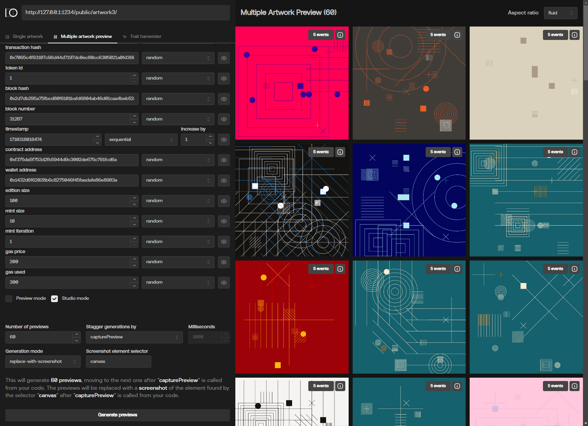

# Highlight studio

Welcome to [Highlight Studio](https://studio.highlight.xyz/)! The companion app designed to help you iterate and test your artwork quickly and reliably.



# Overview

The main goal of **Highlight Studio** is to let artists quickly try out different parameters that affect their artworks, see multiple previews and get a sense of what their traits distribution (chance of occurring) looks like.

The app can be used completely standalone, although with limited functionality. This might be enough for your use case. In the following section we'll describe what core functionality the app provides and how to make the most of it.

For more advanced usage and insight, we highly recommende downloading the [hl-studio.js](./hl-studio.js) script, and importing it right after `hl-gen.js` in your html file. This script takes over the globally exposed `hl object` that hl-gen provides, proxies it, and sends information to Highlight Studio for processing.

Also note that Studio features such as **“trait harvester”** that run your script to get trait information will need a bit of code modification if you would like to test a large sample size (e.g., 10K-100K outputs). But, don’t worry because the modification is a best practice anyway, so doing it will make your code easier to reason about.

**[Download hl-studio.js &darr;](./hl-studio.js)**

**[Download basic-p5-studio-example &darr;](./examples/basic-p5-studio-example/)**

# Getting started

If you just want to quickly test some parameters for your artwork and are not interested in multiple previews or traits, just navigate to https://studio.highlight.xyz/ enter your project URL ([see how here](#project-url)) and have fun!

If however you want a bit more functionality you need to download the [hl-studio.js](./hl-studio.js) script and include it in your HTML file right after hl-gen.js like so:

```html
<head>
  <!-- ... -->
  <script src="lib/hl-gen.js"></script>
  <script src="lib/hl-studio.js"></script>
  <!-- ... -->
</head>
```

And just by doing that, you have now enabled all the features Highlight Studio has to offer! Read more about them down below!

# How to use Highlight Studio

While Studio can be used with your artwork just as-is, and it tries to do some clever tricks to make sure your experience is smooth and performant, it is ultimately up to you, the artist, to help Studio be the best it can be.

This means adding short circuits to your code, which allows for faster executions, omitting code that’s not relevant (e.g. applying an expensive filter over your image is redundant in the case where you're just testing which image gets selected.)

To do this, Studio adds another flag on the `hl.context` object called `studioMode`. This flag is set **ONLY** when loading your artwork from Highlight Studio and when the Studio Mode flag in the form is set. This means you can do things like this:

```javascript
// ....

function draw() {
  background(backgroundColor);

  if (hl.context.studioMode === true) {
    // No need to do anything we just want the background color to show
    return;
  }

  // Draw text
  fill(textColor);
  textFont(plexMono);
  textSize(width * 0.02);
  textAlign(CENTER, CENTER);
  // ....
}
```

This will just draw a background color and skip any other elements. If you can, always do this. Surgically remove parts of the code you don’t need for testing, and in turn all Studio's operations (specifically, Multiple artwork preview and Trait harvester) will work much faster.

Of course do take special care when preparing to deploy. Make sure the code that was used for Highlight Studio is wrapped in if statements like shown above, or completely removed from the final project (if you care about file size.)

# Basic features

Now let's get into it! Next we'll explain the features of Highlight Studio, how to use them, what you need to use them and some tips and tricks.

## Project URL

When first opening Highlight Studio you will be greeted with a very simple input box telling you to set your project URL. What does this mean?

Studio works by embedding your project in an iframe (just like [Highlight.xyz](https://highlight.xyz/) does!) and giving you tools to play around with the artwork. To get started, you need to set the URL that points to the location of your project. Artists usually have a build process in place, where they can quickly iterate on their artwork, by hosting it locally and using features like hot-reload.

If you are one of those artists... great! Just point to your local server and you're good to go!

If not, don't worry. It's super simple. Just navigate to the root folder of your project, open the command line, and run:

```bash
npx http-server

# A few seconds later you should see something like this:

Available on:
<http://192.168.1.119:8080>
<http://127.0.0.1:8080>
```

(Note: this assumes you have node installed, if not check [here](https://nodejs.org/en).)

This little npm package will spin up a small local server which will serve the folder it was executed in. Copy either of the URLs into the input box and click **"Set"**, and you're good to go!

There are more ways of doing the above. My favorite way when developing my artwork is to use **Visual Studio Code** (where I write my code) and take advantage of the [**Live Preview**](https://marketplace.visualstudio.com/items?itemName=ms-vscode.live-server) extension, which also hot reloads the page when I change any part of my code which is pretty neat.

In either case, you now have your project running on a server (which is not exposed to the world, just you locally, but you can change that if you want to show off your work to someone) and Highlight Studio can access it. Great!

Note, you can always change the URL later.

## Tab - Single artwork

This tool can be used without `hl-studio.js`, but will not populate the Token details section.

This is where you will do most of your testing. A simple interface where you can change the parameter sent to your iframe (and picked up by `hl-gen` script.) There is not much to talk about here as it just takes what you would normally have to do by hand (change the URL parameters) and puts it into a nice UI for your convenience. There are also some bells and whistles like randomization, locking and hiding of fields you don’t use.

There is also a new flag you can hook into called `“Studio mode”`, which you can use to make sure Studio-specific code is executed only when using Studio. In the future custom events and triggers that you define will be captured by Highlight Studio allowing you to do more in-depth and custom analysis of your code, but we digress.

Under the generate buttons you will see a `Token details` accordion. This will get populated every time you reload your artwork (assuming you have `hl-studio.js` file present and loaded). This will at a glance show the name, description, traits and the raw JSON data available to your artwork.

## Tab - Multiple artwork preview

Now this is where things get interesting!

This tool can be used without `hl-studio.js` script, but the performance will be worse and you will miss out on token details. However, if all you want is to see how your artworks look, it might do the job just fine!

The purpose of this tab is to see how your artwork behaves over a span of generations. Maybe you would like to make sure that every 100th artwork has that special background color? Or that if you batch mint 10 tokens, one of them will be mirrored?

So many possibilities! So little time to test it manually :(

Well, you are in luck! You are presented with pretty much the same form as in the Single artwork tab, but the fields have additional options specifically made to test sequences of generations.

The options include:

- **Random**: just a random value
- **Locked**: won’t change
- **Random Between**: a random value between two values
- **Sequential**: increase (or decrease if negative) by a certain amount each generation
- **List**: Sequentially pick from a list of values
- **Random List**: Randomly pick from a list of values

With these options you can now program how certain values change over time. In the future there will be more customization options, such as randomly/sequentially picking from a list of provided values.
Underneath the form there are generation options. Let's go through them.

### Number of previews

How many generations to test? Be careful with large numbers, especially if you’re not using the `hl-studio.js` script to generate screenshots of your live artworks.

### Stagger generations by

- **milliseconds**: This will generate a new iframe every x milliseconds. This is slow, unreliable, but can be used without `hl-studio`. If your artwork is simple, doesn’t have a draw loop and is not resource heavy this might be good enough for you!

- **capturePreview**: Needs `hl-studio.js` to work. It waits until your code calls hl.token.capturePreview() then generates the next iframe. This is better as it ensures the artwork is in a good state (good enough to create a preview image of it) before moving on. Use this if you can.

### Generation Mode

What happens to the iframe once it has finished loading?

- **keep-alive**: **Not recommended**. It will keep the iframe as-is, meaning all the resources used by your artwork will compound over the generations. If your artwork is very simple, and the number of generations small, you might get away with it (if it weren't for them meddling kids). This will work without `hl-studio.js` script

- **replace-with-screenshot**: Requires `hl-studio.js` as it replaces the iframe with an image of the artwork when your code calls `hl.token.capturePreview()`. The **“Screenshot element selector”** also becomes enabled, allowing you to specify which element should be the target of the screenshot script. Currently only **img** and **canvas** elements will work (but if you’re using 3D stuff, the canvas might return back a blank image - we're investigating this). This greatly improves the page performance allowing you to have a bigger number of previews generated.

There is also a small text explaining the above in a more concise manner.

## Tab - Trait harvester

This tool allows you to get a birds-eye view of what traits your artwork has. This requires `hl-studio.js` script to be included as it hooks into the global `hl` object.

The form is the same as in the `Multiple artwork preview` allowing you to program how certain values change over time.
Underneath is the generation form. Let's go through it.

### Number of harvests

Pretty self explanatory. How many samples (generations) would you like? Depending on the type of Harvest mode this will greatly impact how long the harvest will take.

### Harvest mode

- **on-trait-set**: This requires no modification of your code. The iframe will load your artwork, wait for you to call `hl.token.setTraits()` (so do it as soon as possible!), capture the traits and reload the iframe with the next URL. Super simple, but also super slow (not to mention a lot of requests to your local server - which is not a problem in this case since its local, but don’t do this to an actual artwork hosted somewhere publicly)

- **on-hl-studio-event**: A (much much much, order of magnitudes) faster way of harvesting your crops.. I mean… traits. But this requires you to change how you set traits. The `hl-studio` will search for a globally defined `calculateHLTraits(hl)` function, pass in a modified instance of the hl object and expects to get back an object of traits. Read more about that function [here](#calculatehltraitshl-function). This also enables the `Batch input field`, allowing you to specify how many harvests happen before the iframe gets reloaded. Some artworks do a lot of calculations for figuring out which traits are going to be set, which can cause some memory leakage and performance problems, so depending on how your artwork behaves, increase or decrease this number.

Once the harvesting has completed (or been stopped) you are presented with the results, showing you all the traits you have set, how many times they occurred and their percentages. in the future there will be a way to quickly look through the results and show / bookmark specific generations, so you can quickly see them in the other two tabs, but for now a `Download RAW JSON` button allows you to download all the data that Highlight Studio got, allowing you to do your own custom analysis, and extract the parameters that created those traits.

## calculateHLTraits(hl) function

This function is used by Studio to quickly harvest traits from your artwork. It expects a `hl` object which you should use to set all the variables your artwork needs. Then return an object containing the traits like so:

```javascript
// These will be used to draw the artwork
let numberOfRectangles;
let randomSaturation;
let randomBrightness;
let backgroundColor;

function calculateHLTraits(hl) {
  // Calculate everything upfront
  numberOfRectangles = hl.randomInt(3, 10);
  randomSaturation = hl.randomInt(100);
  randomBrightness = hl.randomInt(100);
  backgroundColor = hl.randomElement(['white', 'black']);

  const traits = {
    'Number of Rectangles': numberOfRectangles,
    'Background Color': backgroundColor,
    'Color Saturation': randomSaturation,
    'Color Brightness': randomBrightness,
  };

  // Return the traits
  return traits;
}

// Setting the traits as soon as possible
function preload() {
  const traits = calculateHLTraits(hl);
  hl.token.setTraits(traits);
  hl.token.setName(`Token #${hl.tx.tokenId}`);
  hl.token.setDescription(`Description`);
  plexMono = loadFont('fonts/IBMPlexMono-Regular.ttf');
}
```

Note that you need to use the hl object passed to the function for this to work!

In normal rendering the `hl` object is the one from `hl-gen.js` script, but when harvesting traits, Highlight Studio sends in a custom `hl` object with the correct randomness and parameters. This is a bit more work but a best practice in any case. You should calculate as much as you can as fast as you can, before any heavy (drawing or file loading) operations occur, and since they are all in that one nice function, debugging any issues becomes much easier.

## Tab - Series metadata

**Only works in Chrome since it uses its' filesystem API**

> If you just want to use this tab without others, you can enter a **"/"** as the project URL.

If you're just creating a series project this tool is perfect for you! It helps you generate a proper **metadata.json** file and performs validations to help you catch any errors (like duplicate files, unused files etc.) and fix them.

To start have your directory ready, that includes the **images** folder and optionally a **animations** folder. HL Studio will parse this directory and give you autocomplete for the files it finds. If you also already have a **metadata.json** file, Studio will find it, parse it, and also suggest autocomplete for traits.

Sometimes you have a lot of artworks, and creating them by hand in an online editor might not be the best approach. You might, for example, take the build tool route, and have the file names of images contain the name, description and traits for that image, then using a script, parse the file names and generate the **metadata.json** file. That's perfectly fine!

Just let HL Studio find the file, load it and check if it finds any validation errors. If not, you're good to go! But just to be extra sure you can also export the **metadata.json** file with Studio, so that the `metadataId`'s are properly indexed.

Once you're happy with the metadata file, just follow the instructions [here](https://highlight.xyz/tools/collections/create/type/Series), zip the folder and upload it, and you're done!

## Escape hatches

No tool is perfect and can match the users needs in every way. Neither is Highlight Studio (but thank you for thinking it is <3), that’s why there are several escape hatches allowing you to enhance your experience by yourself!

Each iframe comes with two buttons on the top right. `Events` and `Details`. The events shows a raw JSON representation of all the events Highlight Studio received from your artwork. This is what we use to do all the things we do, and you can too!

The details button just shows a simple representation of your token. The name, the details, the traits and the hl parameters used to generate it.

The trait harvesters `Download RAW JSON` will download every event sent by your artwork specific to setting the traits (and no other events as that would flood the file in a large number of harvests).

Technically you can also emit your own events and Highlight Studio will pick them up (but do nothing with them), but this also means you can play around with how events Studio is listening to, get emitted. For example you can short circuit the Multiple artwork preview's `replace-with-screenshot` generation by just emitting the event yourself in some if block and checking if `studioMode` flag is set. This allows you to leave your actual artwork code intact and just add a block specific to when Highlight Studio is running.

Double technically, you could also use the trait harvester and emit objects that contain other information, not just traits, and use that to debug your code. The limit really is your imagination 🌈.

Remember this is a dev tool, use and abuse it in any way you can, no one else will see it except you.

# Example project

There is also a new small example project found here: [basic-p5-studio-example](./examples/basic-p5-studio-example/), which shows how to use the `hl-studio.js` script along with the `calculateHLTraits(hl)` function.

It also includes a very cute **bottle blob** picture, and is worth a download just for that <3

**[Download basic-p5-studio-example &darr;](./examples/basic-p5-studio-example/)**

Got any feedback or suggestions? Send them over to [gm@highlight.xyz](mailto:gm@highlight.xyz).
