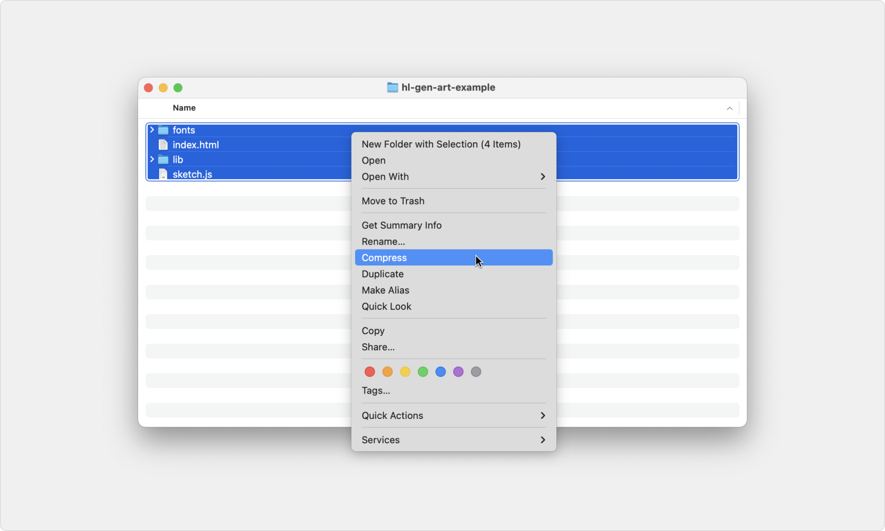

# Creating generative art on Highlight

Generative art collections are Highlight are sets of NFTs that are rendered by an artist's code at the time they're minted. The `hl-gen.js` script powers these collections by giving artists access to:

- [Methods for generating deterministic randomness in your art](#generating-deterministic-randomness-using-hl-genjs)
- [Numerous pieces of data from the blockchain](#data-provided-by-hl-genjs)
- [Methods to set metadata for the tokens in a collection](#setting-token-metadata-using-hl-genjs)
- [A method to trigger the capture of a preview image for a token](#capturing-preview-images-programmatically)

At their core, generative art collections on Highlight are simply packaged web pages that use data inputs to render visual outputs. Projects should contain the following:

- **index.html** _(required)_: This file displays your tokens
- **hl-gen.js** _(required)_: This file gives you access to data from the blockchain, helps you generate deterministic randomness in your tokens, and provides methods to set metadata and capture preview images
- Any libraries required to render your tokens, like p5.js, three.js, tone.js, etc.
- Any other files required to render your tokens, including images, fonts, video files, etc.

Note that, in general, you should not reference external libraries or files, as these references may break in the future. Any resource your project needs to display properly should be included locally.

For example, a simple project using p5.js might look like this:

```
index.html
sketch.js
lib/
  ↳ p5.min.js
  ↳ hl-gen.js
fonts/
  ↳ IBMPlexMono-Regular.ttf
textures/
  ↳ texture-1.png
  ↳ texture-2.png
```

Once you're ready to test or deploy your project on Highlight:

- Create a .zip of your project files, ensuring that you select the group of files to zip, _not_ the folder itself:
  
- Your .zip should not be larger than 2GB. All project assets are stored on Arweave, a decentralized and permanent storage network
- Go to https://highlight.xyz/tools/ and connect your wallet
- Click **Create a collection** and choose **Generative series**
- Upload the .zip file of your code-based generative project and continue with testing

**[Download an example project &darr;](https://github.com/highlightxyz/generative-art/raw/main/examples/basic-p5-example/EXAMPLE_UPLOAD_ME.zip)**

## Adding hl-gen.js to your project

Every project must include the hl-gen.js script, which gives you access to blockchain data and makes it possible to render individual tokens that have been minted.

**[Download hl-gen.js &darr;](./hl-gen.js)**

In your `index.html` file, reference the hl-gen.js script before any of your drawing code:

```javascript
<head>
  <script src="lib/hl-gen.js"></script>
  <script src="lib/p5.min.js"></script>
  <script src="sketch.js"></script>
</head>
```

## Generating deterministic randomness using hl-gen.js

The hl-gen.js script provides a number of methods intended to help you generate deterministic randomness in your artwork. These methods are seeded by a combination of the transaction hash (or a predetermined hash if you choose) and the token ID. It is important to use these methods to generate randomness in place of `Math.random()` or p5’s random function to ensure that, after a token is minted, it renders identically on all subsequent renders.

**random**

```javascript
hl.random(min, max) => Number
```

You can call `hl.random()` with 0, 1, or 2 arguments.

Calling `hl.random()` with 0 arguments returns a random number between 0 (inclusive) and 1 (exclusive).

```javascript
hl.random(); // 0.5265596949029714, 0.08938326966017485, 0.6286451765336096
```

Calling `hl.random(max)` with one argument, `max`, returns a random number between 0 (inclusive) and `max` (exclusive).

```javascript
hl.random(10); // 6.383272618986666, 1.6330017894506454, 0.20435922779142857
```

Calling `hl.random(min, max)` with two arguments, `min` and `max`, returns a random number between `min` (inclusive) and `max` (exclusive).

```javascript
hl.random(100, 200); // 187.3693763744086, 110.8005760004744, 155.7921847794205
```

---

**randomInt**

```javascript
hl.randomInt(min, max) => Number
```

You can call `hl.randomInt()` with 0, 1, or 2 arguments.

Calling `hl.randomInt()` with 0 arguments returns a random integer between 0 (inclusive) and 100 (inclusive). Note that 100 is chosen as a sensible default, in general you should provide a maximum value.

```javascript
hl.randomInt(); // 28, 63, 39
```

Calling `hl.randomInt(max)` with one argument, `max`, returns a random integer between 0 (inclusive) and `max` (inclusive).

```javascript
hl.randomInt(10); // 4, 10, 2
```

Calling `hl.randomInt(min, max)` with two arguments, `min` and `max`, returns a integer number between `min` (inclusive) and `max` (inclusive).

```javascript
hl.random(100, 200); // 162, 117, 181
```

---

**randomBool**

```javascript
hl.randomBool(percent) => Boolean
```

Calling `hl.randomBool(percent)` returns a boolean value with `percent` chance of being `true`. Passing `0` will always result in a return value of `false` while passing 1 will always result in a return value of `true`.

For example, calling `hl.randomBool(0.25)` will have a 25% chance of returning `true` and a 75% chance of returning `false`.

```javascript
hl.randomBool(0.25); // false, true, false, false
```

---

**randomElement**

```javascript
hl.randomElement(array) => any
```

Calling `hl.randomElement()` and passing in an array returns a random element from that array. Each element in the array has an equal chance of being returned. Passing in an empty array will return `undefined`.

The array you pass in can have members all of the same type (`[3, 6, 2, 8]`) or of different types (`["red", 7, true]`).

```javascript
hl.randomElement([
  "red",
  "orange",
  "yellow",
  "green",
  "blue",
  "indigo",
  "violet",
]); // "orange", "blue", "red"
```

---

## Data provided by hl-gen.js

The hl-gen.js script also gives you direct access to a number of pieces of data from the blockchain, including the transaction hash, block hash, minting wallet address, token ID, edition size, and more. All of these pieces of data are available on the `hl.tx` object.

> [!NOTE]
> Note that all of the values discussed below are returned as Strings.

---

**hash**

```javascript
hl.tx.hash: String
```

The transaction hash of the blockchain transaction. If you choose to use preselected hashes in the Highlight UI, this will be one of those preselected hashes. Example value: `0x04c9a6beb46da88f7e955297e53f366654351a61f7d0a8117c12121edddc5bd6`.

---

**timestamp**

```javascript
hl.tx.timestamp: String
```

The timestamp of the blockchain tranaction. Note that this is a Unix timestamp in seconds (not milliseconds). Example value: `1694202763`.

---

**walletAddress**

```javascript
hl.tx.walletAddress: String
```

The wallet address of the minting wallet. Example value: `0x8f5BA1D922F9819eb74F5E083D6eC233e0B208E1`.

---

**tokenId**

```javascript
hl.tx.tokenId: String
```

The token ID of the token being minted. Token IDs start at 1. Example value: `42`.

---

**editionSize**

```javascript
hl.tx.editionSize: String
```

The number of tokens available in this collection. The creator chooses this number in the Highlight UI when creating the collection. Example value: `500`.

---

**mintSize**

```javascript
hl.tx.mintSize: String
```

The number of tokens being minting in the current transaction. If someone mints 10 tokens in a transaction, the this value will be 10. Example value: `10`.

---

**mintIteration**

```javascript
hl.tx.mintIteration: String
```

The token iteration currently being minted within a given transaction. If someone mints 3 tokens in a transaction, this value will iterate from 1 to 3. If only a single token is being minted in a transaction this value will be 1. Example output: `2`.

---

**contractAddress**

```javascript
hl.tx.contractAddress: String
```

The address of the contract for this collection. Example value: `0x93A501dd8C36aE1c3D62b16a0e42222f366F4389`.

---

**blockHash**

```javascript
hl.tx.blockHash: String
```

The hash of the block on which this transaction was completed. Example value: `0x080044cdf672047b7c3232a9a2547e314e5dc085eceb4c7019fc0a89e6594987`.

---

**blockNumber**

```javascript
hl.tx.blockNumber: String
```

The block number (sometimes called block height) of the block on which this transaction was completed. Example value: `18093981`.

---

**chainId**

```javascript
hl.tx.chainId: String
```

The ID of the blockchain for this transaction.

| Blockchain | Mainnet chainId | Testnet chainId |
| ---------- | --------------- | --------------- |
| Ethereum   | 1               | 5               |
| Base       | 8453            | 84531           |
| Arbitrum   | 42161           | 421613          |
| Optimism   | 10              | 420             |
| Polygon    | 137             | 80001           |
| Zora       | 7777777         | 999             |

---

**gasPrice**

```javascript
hl.tx.gasPrice: String
```

The price per unit of gas (in gwei) at the time of mint. The value will be a whole number returned as a string. To get an idea of current gas prices on various chains, reference the following links:

| Blockchain | Link                                |
| ---------- | ----------------------------------- |
| Ethereum   | https://etherscan.io/gastracker     |
| Base       | https://cointool.app/gasPrice/base  |
| Arbitrum   | https://cointool.app/gasPrice/arb   |
| Optimism   | -                                   |
| Polygon    | https://cointool.app/gasPrice/matic |
| Zora       | -                                   |

---

**gasUsed**

```javascript
hl.tx.gasUsed: String
```

The total amount of gas used for the mint transaction. Example value: `51`.

---

**Testing values**

When running your script locally or testing on highlight.xyz, hl-gen.js will generate sensible, random test values for each of the items listed above. The below chart outlines the range of values you can expect.

| Value                 | Link                                                     |
| --------------------- | -------------------------------------------------------- |
| hl.tx.hash            | A randomly generated 64-character hex prefixed with `0x` |
| hl.tx.timestamp       | The current Unix timestamp, e.g. `1694624015`            |
| hl.tx.walletAddress   | A randomly generated 40-character hex prefixed with `0x` |
| hl.tx.tokenId         | A random whole number from 1–100                         |
| hl.tx.editionSize     | A random whole number from 1–100                         |
| hl.tx.mintSize        | A random whole number from 1–19                          |
| hl.tx.mintIteration   | A random whole number from 1–mintSize                    |
| hl.tx.contractAddress | A randomly generated 40-character hex prefixed with `0x` |
| hl.tx.blockNumber     | A random whole number from 1–1000000                     |
| hl.tx.chainId         | A random selection from [1, 5, 137, 80001]               |
| hl.tx.gasPrice        | A random whole number from 10–200                        |
| hl.tx.gasUed          | A random whole number from 10–100                        |

While testing, you may want to fix certain values and not let hl-gen.js randomly generate them. For example, you might want to fix `hl.tx.hash` and `hl.tx.tokenId` to ensure that all of the random functions produce the same values when the page is refreshed. To do this, can use query parameters to specify the values you would like to fix. The following table outlines the query parameter keys to use for the various values:

| Value                 | Query parameter key |
| --------------------- | ------------------- |
| hl.tx.hash            | h                   |
| hl.tx.timestamp       | t                   |
| hl.tx.walletAddress   | wa                  |
| hl.tx.tokenId         | tid                 |
| hl.tx.editionSize     | s                   |
| hl.tx.mintSize        | ms                  |
| hl.tx.mintIteration   | mi                  |
| hl.tx.contractAddress | a                   |
| hl.tx.blockNumber     | bn                  |
| hl.tx.chainId         | c                   |
| hl.tx.gasPrice        | gp                  |
| hl.tx.gasUed          | gu                  |

For example, if you're running your project locally at `http://localhost:3000/`, you can load `http://localhost:3000/?tid=1&h=0x0272d0631fe18566e2a4221db0eb9807b8921713ea37ccd97866e079771e8efa` to fix the tokenId and hash.

---

## Setting token metadata using hl-gen.js

Aside from accessing data, hl-gen.js gives you the ability to set metadata for your tokens by calling the provided methods. This metadata appears both on Highlight and and third-party platforms like OpenSea when displaying your collections and tokens from it. You can set the name, description, or traits of a token. All of these methoda are available on the global `hl.token` object. The `hl.token.setName()` and `hl.token.setDescription()` methods take a String as their only argument, while setTraits takes an object with the keys representing the trait names and the values representing the trait values.

**setTraits**

```javascript
hl.token.setTraits(traits) => Void
```

Sets the traits for the token, where `traits` is an object whose key-value pairs represent trait names and values. The values of the `traits` object will all be converted to Strings, so you should not use Arrays or Objects. You should call `hl.setTraits()` as soon as possible in your script, before drawing or preloading if possible. This ensures Highlight can calculate traits as quickly as possible when testing and revealing tokens.

In this example, we set 3 traits for a token, color, size, and speed:

```javascript
hl.token.setTraits({
  Color: "Blue",
  Size: "Medium",
  Speed: "Fast",
});
```

---

**getTraits**

```javascript
hl.token.getTraits() => Object
```

Returns an object whose key-value pairs represent the traits that have been set for this token.

---

**setName**

```javascript
hl.token.setName(name) => Void
```

Sets the name for this particular token. Note that you are not required to set names for individual tokens. If you don't, token names will simply be the token ID preced by a "#" sign, e.g. "#1", "#74", "#492", etc.

---

**getName**

```javascript
hl.token.getName() => String
```

Returns the name of the token.

---

**setDescription**

```javascript
hl.token.setDescription(description) => Void
```

Sets the description for this particular token. Note that you are not required to set descriptions for individual tokens. If you don't, token descriptions will simply appear as the collection description you provide in the Highlight UI.

---

**getDescription**

```javascript
hl.token.getDescription() => String
```

Returns the description of the token.

---

For example, setting the name, description, and some traits for a token might look like this:

```javascript
let color = hl.randomElement(["Red", "Green", "Blue"]);
let size = hl.randomElement(["Small", "Medium", "Large"]);

hl.token.setName(`${size} ${color} token`);

hl.token.setDescription(
  `This is one token from a series of many. This particular token is ${size} and 
  ${color}.`
);

hl.token.setTraits({
  Size: size,
  Color: color,
});
```

In this example, a single token might have the name “Small Red token” and the description “This is one token from a series of many. This particular token is Small and Red.” The token’s traits would also reflect these values. Note that token name and token description are independent from collection name and collection description, which are set in the Highlight UI, not your code.

## Capturing preview images programmatically

Whenever one of your tokens is minted, Highlight automatically captures and assigns a preview image for that token. This preview image is shown when it is impractical to show a live view, including when a grid a grid of many tokens is shown.

You can trigger this capture programmatically or by specifying a time delay in the Highlight UI. Triggering the capture programmatically allows you to control exactly when the preview image is captured as your code runs. The hl-gen.js script provides the `hl.token.capturePreview()` method to trigger the capture.

```javascript
hl.token.capturePreview() => Void
```

To capture your preview images programmatically, choose this option in the **Preview images** step of the collection creation process and call the provided `hl.token.capturePreview()` method in your code when you want to capture the preview image.

Images are captured as .png by default, but if you your index.html page renders an SVG element, you may choose to capture your preview image as an .svg instead by selecting **Capture a specific element** under the **Preview image area** option in the **Preview images** step of the creation process in the Highlight UI.

When capturing a preview image, we’ll run your code in the background while listening for `hl.token.capturePreview()` to be called. If you’re using this method, ensure it is called within a few minutes of your script starting.

For example, to trigger the capture after the 1000th frame of your script, you could do the following:

```javascript
draw() {
  fill(hl.randomElement(colors));
  rect(hl.random(width), hl.random(height), 200, 200);

  if (frameCount === 1000) {
    hl.token.capturePreview();
    noLoop();
  }
}
```

To determine your script is being run in order to capture a preview image, you can use the `hl.context.previewMode`. This will return `true` if a preview image is being captured and `false` if the script is being run in live view mode.

## Example usage

All of the data inputs and methods discussed above are available on the global `hl` object, which you can reference in your code provided you’ve included hl-gen.js in your project. This example illustrates a simple p5.js sketch that:

- Draws a randomly sized circle in the middle of the canvas
- Fills it with either red, green, or blue
- Displays the minting wallet address, token ID, and timestamp in the center of the circle
- Applies the size and color of the circle as traits of the token
- Captures a preview image

```javascript
function setup() {
  createCanvas(800, 800);
  noLoop();
}

function draw() {
  translate(width / 2, height / 2);

  let size = hl.randomInt(400, 600);
  let color = hl.randomElement(["red", "green", "blue"]);

  noStroke();
  fill(color);
  ellipse(0, 0, size);
  fill("white");
  textAlign(CENTER, CENTER);
  text(
    `${hl.tx.walletAddress}\n
    ${hl.tx.tokenId}\n
    ${hl.tx.timestamp}`,
    0,
    0
  );

  hl.token.setName(`My token #${hl.tx.tokenId}`);

  hl.token.description(
    `A token with token ID ${hl.tx.tokenId}. It is ${size} and ${color}.`
  );

  hl.token.setTraits({
    Size: size,
    Color: color,
  });

  hl.token.capturePreview();
}
```

## Notes on token display and rendering

Generative projects created on Highlight are displayed by rendering your project’s index.html file inside an iframe. This means that your tokens may appear at different sizes at different times. In practice, this means using a fixed size canvas may cause rendering issues. You may either scale your token in order to appear the same at all sizes, or you may have it respond and display differently at different sizes—the choice is yours. In either case, your code should respond to the window resize event to ensure your token renders correctly if the browser is resized.

In the preview images step, you’ll have the option to specify a resolution of the preview image. Note that the aspect ratio used here will be used to render your token on Highlight.
